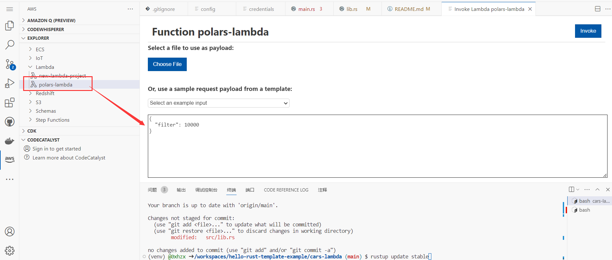
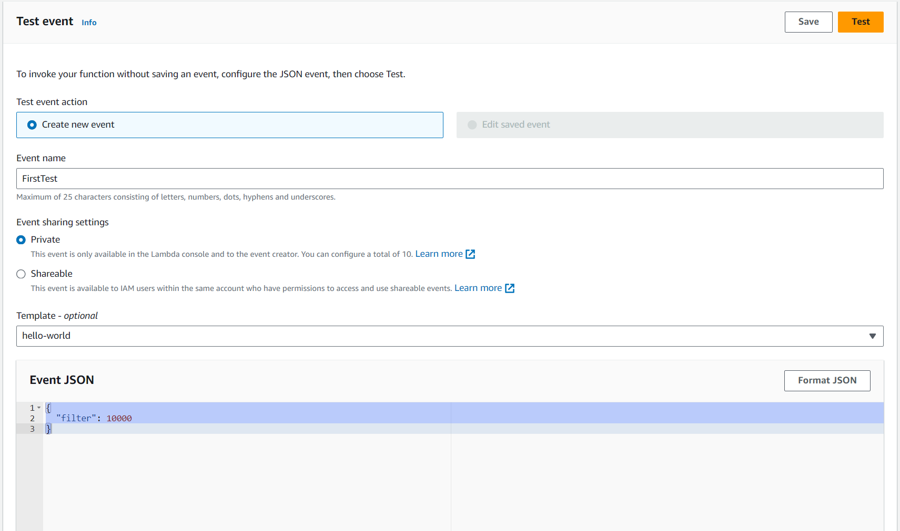
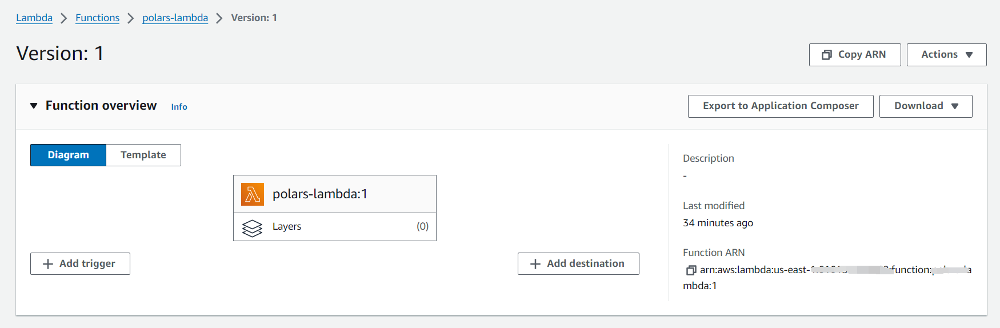
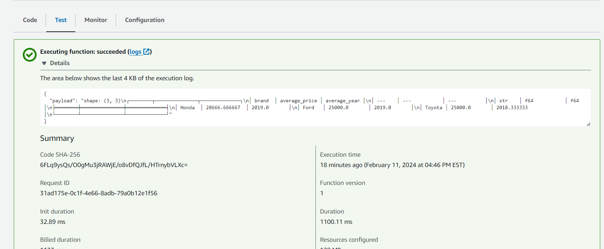

# Rust Cargo Lambda Example
A good starting point for a new Rust project

## Preparation
1. Prepare for the environment.
```shell
sudo apt install python3-pip
python3 -m venv venv
source ./venv/bin/activate
```
2. PiP on any system with Python 3 installed
`pip3 install cargo-lambda`

* [See other installation options](https://github.com/awslabs/aws-lambda-rust-runtime)

3. Ready with the right version of Rust
You can use `rustup default stable` and `rustc --version` to check if your rust version meet the requirements of 1.72.0.

4. Configue the AWS credentials for the extension. 

4. Read the [documents](https://www.cargo-lambda.info/guide/getting-started.html) if you are not familar with Cargo Lambda commands.

## Target
This AWS Lambda function works for selecting the specific rows from Car CSV data that are more expensive than the filter parameter, and then do aggregation for them.

```Rust
pub fn calculate(filter_value: f64) -> Result<DataFrame, PolarsError> {
    let file = Cursor::new(CAR_DATA);

    let df = CsvReader::new(file)
        .has_header(true)
        .finish()?
        .lazy()
        // add filter
        .filter(col("price").gt(lit(filter_value)))
        .group_by(vec![col("brand")])
        .agg(&[
            col("price").mean().alias("average_price"),
            col("year").mean().alias("average_year"),
        ])
        .collect()?;

    Ok(df)
}

```

1. Filtering:
It filters the rows where the column 'price' is greater than a specific value.  

2. Grouping:
The program then groups the data by the 'brand' column, which stands for different brands of the car.  

3. Aggregation:
For each group (species in this case), it calculates the mean value that stands for `average_price` and `average_year`.


## Test
1. Use AWS extension in VScode to invoke the function.


2. You can also test it locally by using `cargo lambda watch` and `cargo lambda invoke --data-ascii "{ \"filter\": 10000}"` command.

3. Test on AWS




## Output
The lambda function show as below




## References

* [rust-cli-template](https://github.com/kbknapp/rust-cli-template)
